### Hi there 👋

I'm Amin Keshavarzi and I'm a frontend developer with over 4 years of experience developing applications and web applications. I'm currently working in DaneshMiranGostar company as a frontend developer.

## Technical Experiences

 

<!-- daneshgostar miran starts -->

#### DaneshGostarMiran company

#### Jan 2022 \_\_\_ Present

### VTES Project:

- it's an E-commerce web application.
- It has a panel for both customers and sellers to track what they have bought / sold.
- for further more information you can check out the website <a target="_blank" href="https://vtes.ir">here</a>

<!-- vtes media starts -->

media about VTES

##### VTES - home page

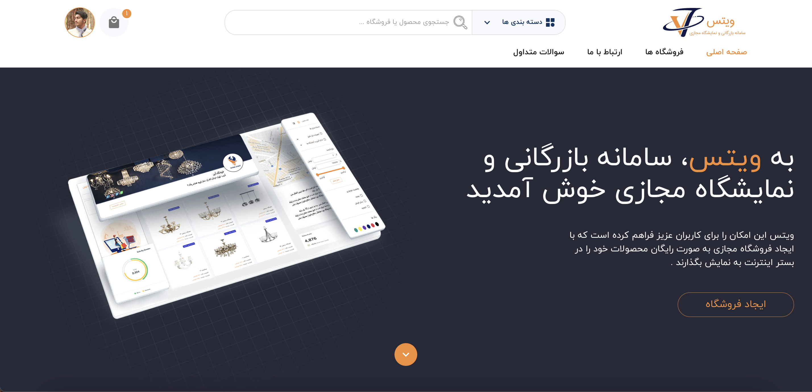

##### VTES - panel - profile page

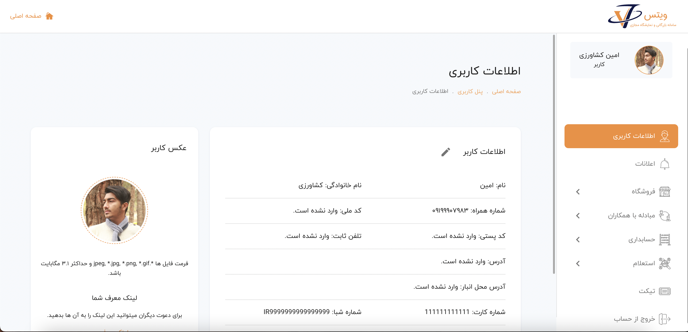

##### VTES - panel - add new product page

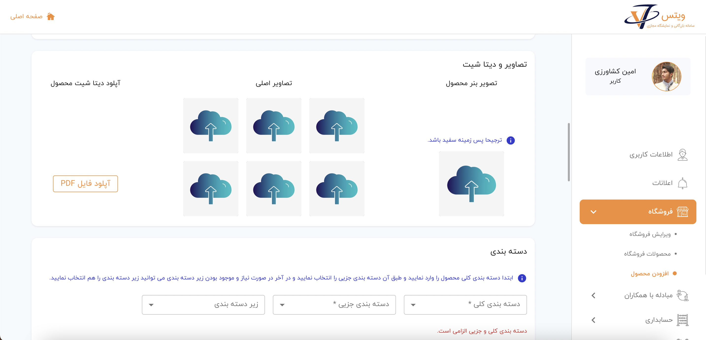
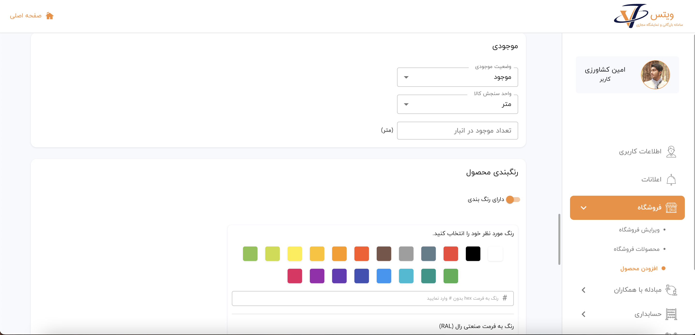
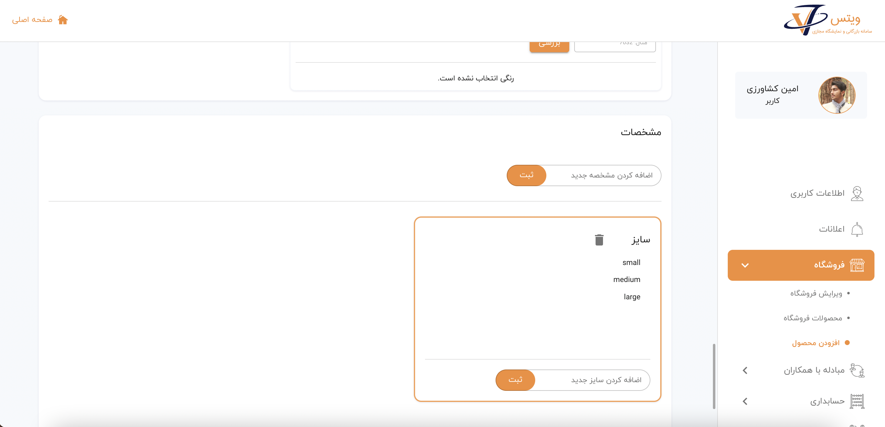

##### VTES - panel - advance search page

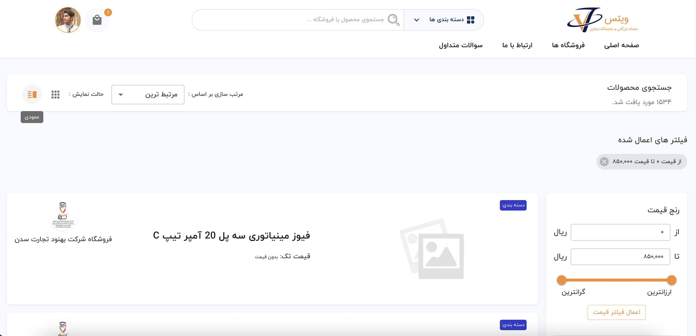

##### VTES - home page video

<video src='./assets/vtes/videos/home-vtes.mp4' width="100%" controls></video>

##### VTES - shops page and product's detail page and cart page video

<video src='./assets/vtes/videos/shop-vtes.mp4' width="100%" controls></video>

##### VTES - about page and contact page video

<video src='./assets/vtes/videos/about-contact-vtes.mp4' width="100%" controls></video>

<!-- vtes media ends -->

### crypto-curency Project:

- Tihs project is an exchange for crypto currencies to make trader’s trade better with better tools such as watch live recent
  transaction for a currency and it’s chart
- Its been developing so some pages might not fucntioning properly.
- for further more information you can check out the website <a target="_blank" href="https://zenix-currency.vercel.app">here</a>

media about crypto-currency

##### crypto-currency panel

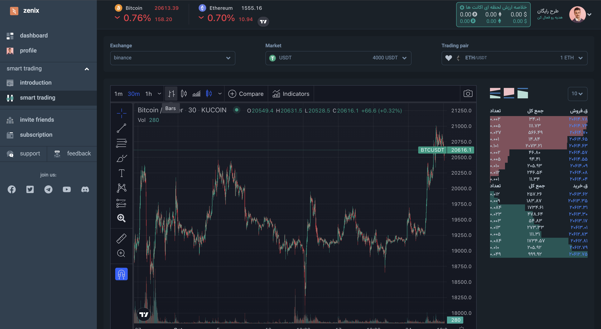

 
 

<!-- daneshgostar miran ends -->

<!-- first freelancing starts -->

#### Freelance

#### Sep 2020 \_\_\_ Jan 2022

### FireDetect Project:

- Fire detect web application for monitoring fire detects modules on the map developed with the ability to model the IoT modules
  and users, buildings, units data.
- We used variety of techs such as socket io to get the live data for locations and their stats.

<!-- fireDetect media starts -->

media about Fire Detect

##### Fire Detect - notification page

##### Fire Detect - add apartment page

##### Fire Detect - home page video

<video style="max-width:500px" src='./assets/firedetect/videos/home-page.mp4' width="100%" controls></video>

##### Fire Detect - add new building page video

<video style="max-width:500px" src='./assets/firedetect/videos/add-building.mp4' width="100%" controls></video>
<video style="max-width:500px" src='./assets/firedetect/videos/edit-building.mp4' width="100%" controls></video>
<video style="max-width:500px" src='./assets/firedetect/videos/edit-building2.mp4' width="100%" controls></video>
<video style="max-width:500px" src='./assets/firedetect/videos/edit-building3.mp4' width="100%" controls></video>
<video style="max-width:500px" src='./assets/firedetect/videos/edit-building4.mp4' width="100%" controls></video>

##### Fire Detect - add simcard page video

<video style="max-width:500px" src='./assets/firedetect/videos/add-simcard.mp4' width="100%" controls></video>

##### Fire Detect - add module page video

<video style="max-width:500px" src='./assets/firedetect/videos/add-module.mp4' width="100%" controls></video>

##### Fire Detect - profile page video

<video style="max-width:500px" src='./assets/firedetect/videos/profile-fire-detect.mp4' width="100%" controls></video>

##### Fire Detect - user management page video

<video style="max-width:500px" src='./assets/firedetect/videos/user-management.mp4' width="100%" controls></video>

<!-- fire detect media ends -->

### AVeryGoodSamplePack Project:

- A Very Good Sample Pack is an online sample packs and beat market place from top selling music producers.
- The owner was one the Persian singers in England.

<!-- AVeryGoodSamplePack media starts -->

media about AVeryGoodSamplePack

##### AVeryGoodSamplePack - home page

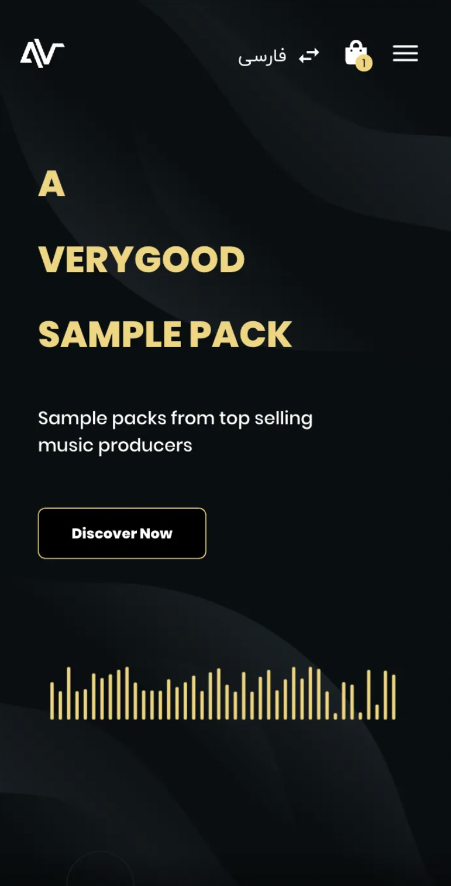

##### AVeryGoodSamplePack - home page video

<video src='./assets/samplePack/videos/home-page.mp4' width="100%" style="max-width:500px" controls></video>

##### AVeryGoodSamplePack - detail beats page video

<video src='./assets/samplePack/videos/detail-page1.mp4' width="100%" style="max-width:500px" controls></video>
<video src='./assets/samplePack/videos/detail-page2.mp4' width="100%" style="max-width:500px" controls></video>

##### AVeryGoodSamplePack - cart page video

<video src='./assets/samplePack/videos/cart-page.mp4' width="100%" style="max-width:500px" controls></video>

##### AVeryGoodSamplePack - profile page video

<video src='./assets/samplePack/videos/profile-page.mp4' width="100%" style="max-width:500px" controls></video>

<!-- AVeryGoodSamplePack media ends -->

<!-- first freelancing ends -->

<!-- afrang art starts -->

#### Afrang art

#### Jun 2019 \_\_\_ Sep 2020

• I have developed 2 projects. the first on was Stylett. Stylett is an ecommerce application in which producers can offer their products with the possibility of personalizing and customizing the product for customers.
• It was my first serious project and I was responsible for developing some pages and maintaining other pages when we had some conflicts.
• other project is Quick part web application. The Quick Parts Price search application is a platform in which sellers can find out the price of auto parts and order if they wish.
• I was responsible for implementing it’s panel. because the project included both panel web application and android application with flutter.

<!-- afrang art ends -->

<!-- Freelance starts -->

#### Freelance

#### Mar 2019 \_\_\_ Jun 2019

### Stylett Project:

- I have developed 2 projects. the first on was Stylett. Stylett is an ecommerce application in which producers can offer their products with the possibility of personalizing and customizing the product for customers.
- It was my first serious project and I was responsible for developing some pages and maintaining other pages when we had some conflicts.

<!-- Stylett media starts -->

media about Stylett

##### Stylett - Home page

<video src='./assets/stylett/videos/homepage-stylett.mp4' width="100%" style="max-width:500px" controls></video>

##### Stylett - Customize page

<video src='./assets/stylett/videos/customize-stylett.mp4' width="100%" style="max-width:500px" controls></video>
<video src='./assets/stylett/videos/customize2-stylett.mp4' width="100%" style="max-width:500px" controls></video>
<video src='./assets/stylett/videos/customize3-stylett.mp4' width="100%" style="max-width:500px" controls></video>
<video src='./assets/stylett/videos/customize4-stylett.mp4' width="100%" style="max-width:500px" controls></video>

##### Stylett - Customize page - images

<!-- Stylett media ends -->

### Quick part Project:

- other project is Quick part web application. The Quick Parts Price search application is a platform in which sellers can find out the price of auto parts and order if they wish.
- I was responsible for implementing it’s panel. because the project included both panel web application and android application with flutter.

<!-- Quick part media starts -->

media about Quick part

##### quick-part - panel

<video src='./assets/quick-part/videos/panel-quickpart.mp4' width="100%" style="max-width:500px" controls></video>

##### quick-part - app pages - images

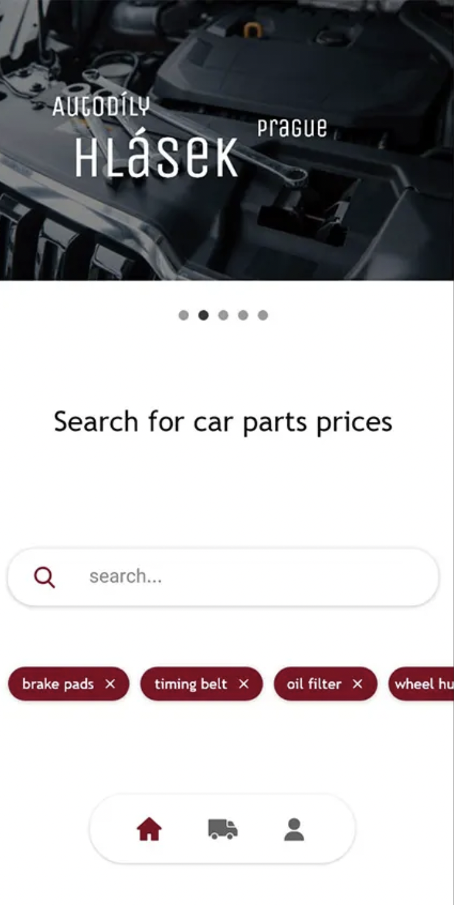
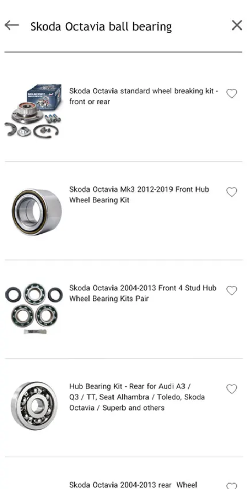
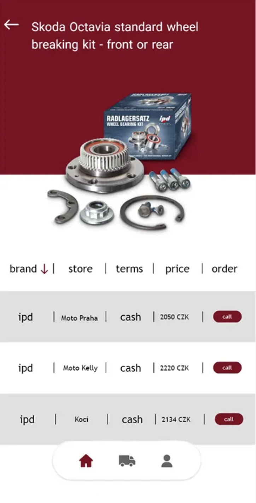

<!-- Quick part media ends -->

<!-- Freelance ends -->
